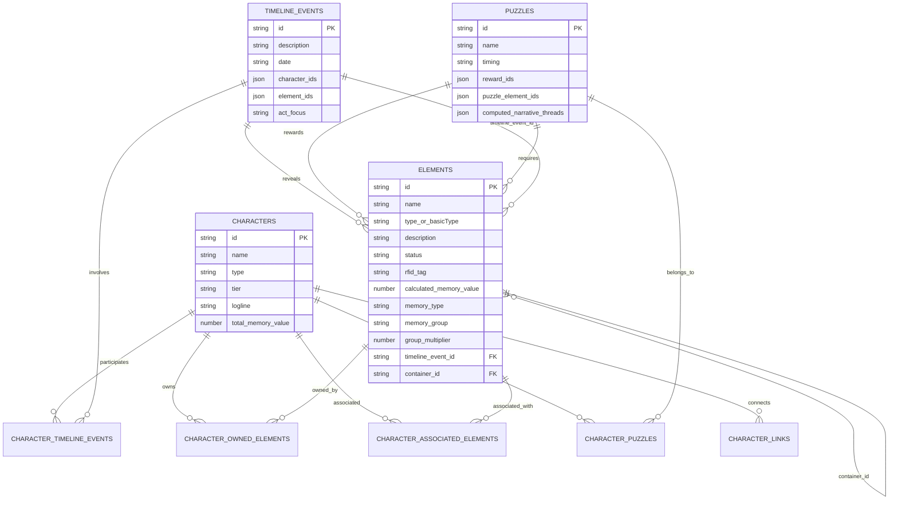

# ALNTool Architecture Deep Dive
**Date**: January 14, 2025  
**Version**: 1.0  
**Status**: Complete architectural analysis of current implementation

## Executive Summary

ALNTool is a design decision support intelligence system for the "About Last Night" murder mystery game. It transforms 18 separate database views into a unified interface where game designers can select any entity and instantly see complete impact analysis across story, social, economic, and production dimensions.

## System Overview


## Frontend Architecture

### Component Hierarchy


### State Management Architecture


### Data Flow Patterns


## Backend Architecture

### Service Layer Architecture


### 4-Phase Sync Pipeline


## Data Architecture

### Entity Relationship Diagram



### Dual-Path API Architecture


## Intelligence Layer Architecture

### Intelligence Layer Data Flow


## Social Choreography System


## Memory Token Economy Flow


## Performance Optimization Strategy


## System Integration Points

### API Response Standardization

```javascript
// Success Response Structure
{
  "success": true,
  "data": {
    // Response payload
  },
  "message": "Optional success message"
}

// Error Response Structure
{
  "success": false,
  "error": {
    "message": "Error description",
    "code": "ERROR_CODE",
    "details": {} // Optional
  }
}
```

### Key Integration Patterns

1. **Unified API Service**: Single `api.js` file handles all HTTP communication
2. **Response Wrapper**: Middleware ensures consistent response format
3. **Error Boundaries**: 79 error boundaries prevent cascade failures
4. **State Persistence**: Zustand store persists to localStorage
5. **Performance Monitoring**: Built-in performance indicators
6. **Logger Utility**: Replaces console.log for production safety

## Current Implementation Gaps

### Completed (Phase 1 - Days 1-8)
- ✅ Unified JourneyIntelligenceView interface
- ✅ All 5 intelligence layers implemented
- ✅ Entity selector with search functionality
- ✅ State persistence with localStorage
- ✅ Progressive entity loading
- ✅ Character relationship edges
- ✅ Custom node shapes per entity type

### Remaining (Phase 1 - Days 9-11)
- ❌ Force-directed layout (currently using grid)
- ❌ Radial layout for character focus mode
- ❌ Intelligence layer data visualization
- ❌ 3-layer maximum enforcement
- ❌ Hover states showing connections
- ❌ Keyboard shortcuts
- ❌ Zoom constraints
- ❌ Performance with 400+ entities

### Future Phases (Not Started)
- Phase 2: Real-time content creation
- Phase 3: Bidirectional Notion sync
- Phase 4: Collaborative design platform

## Architecture Strengths

1. **Clean Separation**: Frontend/Backend clearly separated with API boundary
2. **Scalable State**: Zustand + React Query handles complex state elegantly
3. **Performance First**: Dual-path API, computed fields, smart aggregation
4. **Extensible**: Intelligence layers can be added without core changes
5. **Error Resilient**: Comprehensive error handling at every level

## Architecture Considerations

1. **Complexity**: 4-dimensional analysis requires careful state management
2. **Performance**: 400+ entities push ReactFlow limits
3. **Data Freshness**: Dual-path API balances performance vs real-time
4. **Testing**: Complex interactions require comprehensive test coverage

---

*This architecture supports the transformation from 18 separate database views into a unified design decision support intelligence system for complex social narrative game design.*