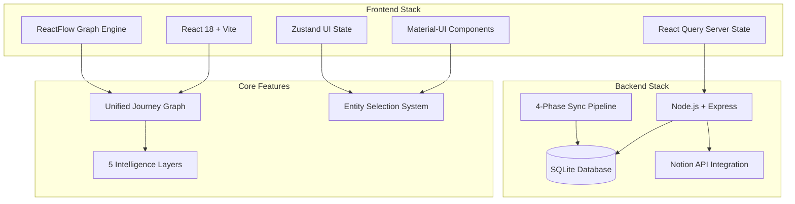
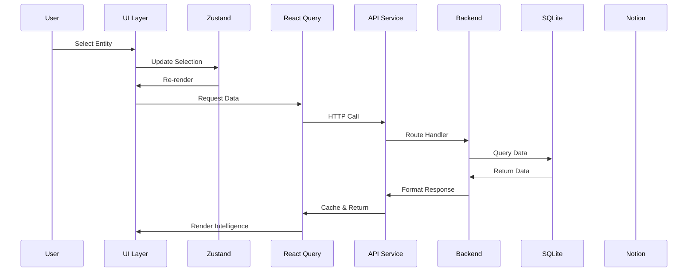

# ALNTool Architecture Quick Reference

## High-Level Architecture



## Key Architectural Decisions

### 1. Single Page Application
- **Before**: 18 separate pages for different views
- **Now**: Single JourneyIntelligenceView with overlays
- **Impact**: Zero context switching, unified experience

### 2. Dual-Path API Architecture
```
Performance Path: /api/elements?filterGroup=memoryTypes
├── Returns 'type' field
├── Pre-computed values from SQLite
└── Used for: Memory economy, production views

Fresh Path: /api/elements  
├── Returns 'basicType' field
├── Real-time data from Notion
└── Used for: Content editing, relationships
```

### 3. State Management Split
```
Zustand (UI State Only)
├── selectedEntity
├── viewMode
├── activeIntelligence
└── graphConfig

React Query (Server State)
├── Character data
├── Element data
├── Puzzle data
└── Timeline events
```

### 4. Intelligence Layer System
1. **Economic**: Token values, path balance, choice pressure
2. **Story**: Timeline connections, narrative gaps, revelation flow
3. **Social**: Collaboration requirements, interaction choreography
4. **Production**: Props, RFID status, physical dependencies
5. **Content Gaps**: Missing story elements, integration opportunities

### 5. Performance Boundaries
- **50-node limit**: Smart aggregation above threshold
- **Initial load**: Characters only, progressive loading
- **2-second target**: Full interface load with 400+ entities

## Data Flow



## File Structure

```
storyforge/
├── frontend/
│   ├── src/
│   │   ├── components/
│   │   │   ├── JourneyIntelligenceView.jsx (main)
│   │   │   └── JourneyIntelligence/
│   │   │       ├── AdaptiveGraphCanvas.jsx
│   │   │       ├── IntelligencePanel.jsx
│   │   │       ├── nodes/ (4 entity types)
│   │   │       └── layers/ (5 intelligence)
│   │   ├── stores/
│   │   │   └── journeyIntelligenceStore.js
│   │   ├── hooks/
│   │   │   ├── usePerformanceElements.js
│   │   │   └── useFreshElements.js
│   │   └── services/
│   │       └── api.js (unified)
└── backend/
    ├── src/
    │   ├── routes/
    │   ├── controllers/
    │   ├── services/
    │   │   ├── sync/ (Notion sync)
    │   │   └── compute/ (calculations)
    │   └── db/
    │       └── migrations/ (11 files)
    └── data/
        └── production.db
```

## Critical Patterns

### Response Wrapper
```javascript
// All API responses follow this format
{
  success: true,
  data: { /* payload */ },
  message: "optional"
}
// OR
{
  success: false,
  error: {
    message: "description",
    code: "ERROR_CODE"
  }
}
```

### Entity Type Handling
```javascript
// Helper function for dual-path compatibility
export const getElementType = (element) => {
  return element.type || element.basicType || 'Unknown';
};
```

### Performance Hooks
```javascript
// Performance path - computed values
const { data } = usePerformanceElements();

// Fresh path - real-time data  
const { data } = useFreshElements();
```

## Quick Commands

```bash
# Development
cd storyforge/backend && npm run dev  # Port 3001
cd storyforge/frontend && npm run dev # Port 3000

# Testing
npm test JourneyIntelligenceView      # Component test
npm run test:e2e                      # E2E tests
npm run verify:all                    # All checks

# Data Operations
node scripts/sync-data.js             # Manual sync
sqlite3 data/production.db            # Direct DB
```

## Phase 1 Progress

**Completed (Days 1-9)**:
- ✅ Core architecture implementation
- ✅ All 5 intelligence layers
- ✅ Entity search & selection
- ✅ State persistence
- ✅ Progressive loading
- ✅ Custom node shapes

**Remaining (Days 10-11)**:
- ⏳ Force-directed layouts
- ⏳ Intelligence visualizations
- ⏳ Performance optimization
- ⏳ Keyboard shortcuts

---

*Quick reference for ALNTool's unified design intelligence architecture*