# Documentation Authority Matrix

> **Executive Summary**: Defines the authoritative hierarchy for resolving conflicts between code, database, and documentation. Establishes a 6-tier system where code/database (Tier 1) always overrides documentation. Provides clear ownership domains for each core document, conflict resolution protocols, and update triggers. Essential for maintaining documentation integrity and making consistent decisions when sources disagree.

## Purpose
This document establishes the authoritative hierarchy for all documentation and implementation decisions in the About Last Night Production Intelligence Tool. When conflicts arise between different sources, this matrix provides clear resolution paths.

## 🗺️ Claude Quick Nav

**Top Sections for Quick Access:**
1. [🏛️ The 6-Tier Authority Hierarchy](#%EF%B8%8F-the-6-tier-authority-hierarchy) - Resolution order
2. [📖 Core Document Authorities](#-core-document-authorities) - Who owns what
3. [🔄 Conflict Resolution Protocol](#-conflict-resolution-protocol) - How to handle conflicts
4. [📝 Update Triggers](#-update-triggers) - When to update docs
5. [✅ Quick Conflict Resolution Checklist](#-quick-conflict-resolution-checklist) - Step-by-step guide

**Search Keywords:** 
`authority`, `conflict`, `hierarchy`, `truth`, `resolution`, `update`, `tier`, `source`, `precedence`

**Cross-References:**
- Implementation truth → Code & Database (Tier 1)
- Strategy & direction → PRD & Notion (Tier 2)
- Current work → [README.md](./README.md) & [DEVELOPMENT_PLAYBOOK.md](./DEVELOPMENT_PLAYBOOK.md) (Tier 3)

## 🏛️ The 6-Tier Authority Hierarchy

### Visual Hierarchy
```
┌─────────────────────────────────────────────────────────────┐
│                    TIER 1: TRUTH SOURCES                    │
│                 Code & Database (Ultimate Authority)         │
├─────────────────────────────────────────────────────────────┤
│                  TIER 2: STRATEGIC AUTHORITIES              │
│                      PRD & Notion Data                      │
├─────────────────────────────────────────────────────────────┤
│                 TIER 3: OPERATIONAL AUTHORITIES             │
│                   README & DEVELOPMENT_PLAYBOOK             │
├─────────────────────────────────────────────────────────────┤
│                  TIER 4: TECHNICAL AUTHORITIES              │
│                    Migrations & Test Suites                 │
├─────────────────────────────────────────────────────────────┤
│                  TIER 5: REFERENCE AUTHORITIES              │
│                   Historical Docs & Archives                │
├─────────────────────────────────────────────────────────────┤
│                 TIER 6: ONBOARDING AUTHORITIES              │
│                      CLAUDE.md & Guides                     │
└─────────────────────────────────────────────────────────────┘
```

## 📊 Detailed Authority Definitions

### TIER 1: Truth Sources (Override All Others)
These represent the actual system state and behavior. No documentation can contradict these.

| Authority | Location | Owns | When Consulted |
|-----------|----------|------|----------------|
| **Production Code** | `/storyforge/backend/src/` `/storyforge/frontend/src/` | - Actual system behavior<br>- Available features<br>- API contracts<br>- Business logic | - What does the system actually do?<br>- Is this feature implemented?<br>- How does this work? |
| **Database** | `/storyforge/backend/data/production.db` | - Current data state<br>- Actual schema structure<br>- Real relationships<br>- Data constraints | - What data exists?<br>- What are the actual field names?<br>- Are these tables related? |

### TIER 2: Strategic Authorities (Define Direction)
These define what should be built and why. They guide but don't override implementation reality.

| Authority | Location | Owns | When Consulted |
|-----------|----------|------|----------------|
| **PRD** | Archived in `/docs/archive/requirements/` | - Product vision<br>- Target users<br>- Core requirements<br>- Success metrics | - What are we building?<br>- Who is this for?<br>- What defines success? |
| **Notion Data** | External Notion workspace | - Game content<br>- Creative vision<br>- Design intent<br>- Content relationships | - What game content exists?<br>- How should content relate?<br>- What's the creative intent? |

### TIER 3: Operational Authorities (Guide Daily Work)
These are the primary working documents that guide implementation and current status.

| Authority | Location | Owns | When Consulted |
|-----------|----------|------|----------------|
| **README.md** | `/README.md` | - Current project status<br>- Sprint progress<br>- Known issues<br>- Setup instructions | - What's the current state?<br>- What are we working on?<br>- How do I get started? |
| **DEVELOPMENT_PLAYBOOK.md** | `/DEVELOPMENT_PLAYBOOK.md` | - Implementation patterns<br>- Technical requirements<br>- Architecture decisions<br>- Performance targets | - How should I build this?<br>- What patterns to follow?<br>- What are the standards? |

### TIER 4: Technical Authorities (Implementation Details)
These define the technical implementation specifics and constraints.

| Authority | Location | Owns | When Consulted |
|-----------|----------|------|----------------|
| **Migration Files** | `/storyforge/backend/src/db/migration-scripts/` | - Schema evolution<br>- Data structure changes<br>- Constraint definitions<br>- Table relationships | - What's the schema history?<br>- When did this field appear?<br>- What are the constraints? |
| **Test Suites** | `**/__tests__/` `**.test.js` | - Expected behavior<br>- Edge cases<br>- Integration points<br>- Performance benchmarks | - What's the expected behavior?<br>- What are the edge cases?<br>- Does this integration work? |

### TIER 5: Reference Authorities (Context and History)
These provide historical context and known issues but don't define current state.

| Authority | Location | Owns | When Consulted |
|-----------|----------|------|----------------|
| **Archive Docs** | `/docs/archive/` | - Historical decisions<br>- Past implementations<br>- Deprecated features<br>- Lessons learned | - Why was this decision made?<br>- What did we try before?<br>- What didn't work? |
| **Git History** | Git commits and PRs | - Change rationale<br>- Implementation timeline<br>- Bug fix history<br>- Feature evolution | - When did this change?<br>- Why was this modified?<br>- Who made this decision? |

### TIER 6: Onboarding Authorities (Entry Points)
These help newcomers understand the system but defer to higher authorities for specifics.

| Authority | Location | Owns | When Consulted |
|-----------|----------|------|----------------|
| **CLAUDE.md** | `/CLAUDE.md` | - Claude workflow<br>- AI guidelines<br>- Context priorities<br>- Common patterns | - How should Claude work?<br>- What context is critical?<br>- What to verify first? |
| **SCHEMA_MAPPING_GUIDE.md** | `/SCHEMA_MAPPING_GUIDE.md` | - Field mappings<br>- Data transformations<br>- Computed fields<br>- Sync patterns | - How do fields map?<br>- What gets computed?<br>- How does sync work? |

## 🔄 Conflict Resolution Process

### When Authorities Conflict

1. **Higher Tier Always Wins**
   - Tier 1 overrides all others
   - Each tier overrides all tiers below it
   
2. **Within Same Tier**
   - Most recent information wins
   - Active files override archived files
   - Specific overrides general

3. **Resolution Examples**

#### Example 1: Schema Conflict
```
Conflict: SCHEMA_MAPPING_GUIDE says field is "character1_id"
         Database shows field is "character_a_id"

Resolution: Tier 1 (Database) wins
Action: Update SCHEMA_MAPPING_GUIDE to match database
```

#### Example 2: Feature Status
```
Conflict: README says "Phase 1 implementation"
         Code shows Phase 4+ features exist

Resolution: Tier 1 (Code) wins
Action: Update README to reflect actual implementation
```

#### Example 3: Requirements vs Reality
```
Conflict: PRD requires real-time sync
         Implementation uses batch sync

Resolution: Tier 1 (Code) reflects reality
           Tier 2 (PRD) shows original intent
Action: Document gap between intent and implementation
```

## 📋 Domain Ownership Matrix

| Knowledge Domain | Primary Authority | Backup Authority | Update Frequency |
|------------------|-------------------|------------------|------------------|
| **Current Sprint Status** | README.md | Git commits | Daily |
| **Project Phase** | README.md | DEVELOPMENT_PLAYBOOK.md | Weekly |
| **Technical Patterns** | DEVELOPMENT_PLAYBOOK.md | Code examples | As needed |
| **Database Schema** | Migration files | production.db | Per migration |
| **API Contracts** | Code (routes, controllers) | API tests | Per change |
| **Performance Targets** | DEVELOPMENT_PLAYBOOK.md | Test benchmarks | Quarterly |
| **User Requirements** | PRD (archived) | README.md updates | Stable |
| **Game Content** | Notion | Local SQLite cache | Per sync |
| **Bug Status** | README.md | GitHub Issues | Daily |
| **Test Coverage** | Test files | Coverage reports | Per PR |

## 🎯 Decision Flow Charts

### "What Should I Build?" Decision Flow
```
Start: Need to implement feature
  ↓
Check PRD for original requirements
  ↓
Check DEVELOPMENT_PLAYBOOK for patterns
  ↓
Check existing code for examples
  ↓
Implement following established patterns
```

### "Is This Working Correctly?" Decision Flow
```
Start: Question about behavior
  ↓
Check production code first
  ↓
Run relevant tests
  ↓
Check database state if data-related
  ↓
Documentation is reference only
```

### "Where Is This Documented?" Decision Flow
```
Start: Looking for information
  ↓
Current status? → README.md
  ↓
How to build? → DEVELOPMENT_PLAYBOOK.md
  ↓
Data structure? → SCHEMA_MAPPING_GUIDE.md
  ↓
Historical context? → /docs/archive/
```

## 🚨 Common Scenarios

### Scenario 1: "The sync is failing"
1. Check code in `/storyforge/backend/src/services/sync/` (Tier 1)
2. Check error logs for specific failure
3. Verify database schema matches migrations (Tier 1)
4. Only then consult documentation for insights

### Scenario 2: "What fields should this table have?"
1. Check migration files for authoritative schema (Tier 4)
2. Verify against actual database (Tier 1)
3. SCHEMA_MAPPING_GUIDE is reference only (Tier 6)

### Scenario 3: "Is this feature complete?"
1. Check if code exists and works (Tier 1)
2. Run tests to verify behavior (Tier 4)
3. README status is informational (Tier 3)

### Scenario 4: "How should errors be handled?"
1. Check existing error handling in code (Tier 1)
2. Look for patterns in DEVELOPMENT_PLAYBOOK (Tier 3)
3. Follow established patterns

## 📝 Edge Cases

### When No Authority Exists
1. Escalate to team/user for decision
2. Document decision in appropriate tier
3. Update this matrix if new domain discovered

### When Authority Is Ambiguous
1. Default to Tier 1 (implementation reality)
2. Document ambiguity for future clarification
3. Add clarification to appropriate authority

### When Authorities Are All Wrong
1. Fix Tier 1 first (code/database)
2. Cascade updates down the hierarchy
3. Document why all were wrong

## 🔧 Maintenance

### Update Triggers by Tier

| Tier | Update When | Update What | Who Updates |
|------|-------------|-------------|-------------|
| Tier 1 | Code changes merged | Behavior changes | Developers |
| Tier 2 | Strategic pivots | Vision/requirements | Product Owner |
| Tier 3 | Sprint changes | Status/patterns | Team Lead |
| Tier 4 | Schema/test changes | Technical specs | Developers |
| Tier 5 | Major milestones | Historical record | Team |
| Tier 6 | Onboarding feedback | Guides/mappings | Any team member |

### Health Checks
- **Weekly**: README.md current status accurate?
- **Per PR**: Documentation impact considered?
- **Monthly**: Authority conflicts emerged?
- **Quarterly**: Matrix still serving needs?

## 🎓 Training Quick Start

### For New Team Members
1. Read this matrix first
2. Understand the 6 tiers
3. Review detailed training guides:
   - **Developer Quick Start Guide**: `/docs/DEVELOPER_QUICK_START.md` - Quick onboarding and common scenarios
   - **Troubleshooting Guide**: `/docs/TROUBLESHOOTING_GUIDE.md` - Common issues and solutions
4. Know that code > documentation
5. When in doubt, check implementation

### For Claude Code Sessions
1. Verify against Tier 1 first
2. Use this matrix for conflict resolution
3. Consult the **Claude Code Guide**: `/docs/CLAUDE_CODE_GUIDE.md` for detailed workflows
4. Update docs when reality differs
5. Flag unresolved conflicts

### Key Principle
**"Implementation is truth. Documentation is a map. When the territory and map disagree, the territory is correct."**

## 📋 Update Protocol Definition

### Overview
This protocol defines WHEN documents update, WHO updates them, HOW updates cascade through the authority hierarchy, and WHAT validation ensures consistency.

### 🔄 Update Triggers by Document Type

#### Tier 1: Truth Sources (Code & Database)
**These create update requirements for all lower tiers**

| Change Type | Trigger | Cascading Updates Required | Validation |
|-------------|---------|---------------------------|------------|
| **New Feature** | PR merged with feature | - README.md: Add to current status<br>- DEVELOPMENT_PLAYBOOK.md: Add patterns<br>- SCHEMA_MAPPING_GUIDE.md: Add new fields | `npm test` passes |
| **Bug Fix** | PR merged with fix | - README.md: Update known issues<br>- TROUBLESHOOTING: Add solution | Tests verify fix |
| **Schema Change** | Migration applied | - SCHEMA_MAPPING_GUIDE.md: Update mappings<br>- Test data: Update fixtures | Migration rollback works |
| **API Change** | Route/contract modified | - DEVELOPMENT_PLAYBOOK.md: Update API docs<br>- Tests: Update integration tests | API tests pass |
| **Performance Change** | Optimization merged | - DEVELOPMENT_PLAYBOOK.md: Update targets<br>- README.md: Note improvements | Benchmarks improve |

#### Tier 3: Operational Authorities (README & DEVELOPMENT_PLAYBOOK)
**These update based on Tier 1 changes and workflow events**

| Document | Update Trigger | Update Frequency | Automation |
|----------|---------------|------------------|------------|
| **README.md** | - Task completion<br>- Sprint change<br>- Issue discovered<br>- Milestone reached | Daily during active dev | `npm run docs:task-complete` |
| **DEVELOPMENT_PLAYBOOK.md** | - New pattern established<br>- Architecture decision<br>- Performance target change<br>- Requirements clarification | As needed | Manual with review |

#### Tier 6: Onboarding Authorities (CLAUDE.md & SCHEMA_MAPPING_GUIDE.md)
**These update when their specific domains change**

| Document | Update Trigger | Validation Required |
|----------|---------------|-------------------|
| **CLAUDE.md** | - Workflow improvement<br>- New Claude pattern<br>- Context discovery | Tested in Claude session |
| **SCHEMA_MAPPING_GUIDE.md** | - Field mapping change<br>- Sync logic update<br>- Computed field addition | Sync completes successfully |

### 🚦 Update Workflows

#### Workflow 1: Feature Implementation

```mermaid
graph TD
    A[Feature Implemented] --> B[Code Merged to main]
    B --> C{Automated Checks}
    C -->|Pass| D[Update README Status]
    C -->|Pass| E[Update DEVELOPMENT_PLAYBOOK Patterns]
    C -->|Schema Change| F[Update SCHEMA_MAPPING_GUIDE]
    D --> G[Run npm run docs:verify-sync]
    E --> G
    F --> G
    G -->|All Synced| H[✅ Complete]
    G -->|Conflicts| I[🔴 Fix Conflicts]
```


#### Workflow 2: Bug Discovery & Fix


#### Workflow 3: Documentation Conflict Resolution

```mermaid
graph TD
    A[Conflict Detected] --> B{Which Tiers?}
    B -->|Different Tiers| C[Higher Tier Wins]
    B -->|Same Tier| D[Most Recent Wins]
    C --> E[Update Lower Tier Docs]
    D --> F[Consolidate to Single Source]
    E --> G[Validate No Cascading Conflicts]
    F --> G
    G --> H[✅ Resolved]
```


### 📅 Update Schedules

#### Automated Updates (via TaskStatusManager)
- **Every Commit**: Git hooks check for doc impact
- **Every PR**: Validation of doc-code alignment
- **Task Completion**: `npm run docs:task-complete <task-id>`
- **Daily**: `npm run docs:status-report`

#### Manual Review Cycles
- **Weekly**: README.md current sprint status
- **Bi-weekly**: DEVELOPMENT_PLAYBOOK.md patterns review
- **Monthly**: Full documentation consistency check
- **Quarterly**: Authority matrix effectiveness review

### 🔍 Validation Rules

#### 1. Consistency Validation
```bash
npm run docs:verify-sync
```
Checks:
- ✓ All AUTO: tags have matching content
- ✓ No conflicting information between tiers
- ✓ All file references are valid
- ✓ No orphaned documentation

#### 2. Authority Validation
```bash
npm run docs:verify-authority
```
Checks:
- ✓ Each domain has single primary owner
- ✓ No unauthorized updates to higher tiers
- ✓ Proper cascade of updates
- ✓ Archive contains only historical docs

#### 3. Completeness Validation
```bash
npm run docs:verify-complete
```
Checks:
- ✓ All known issues documented
- ✓ All features have patterns documented
- ✓ All schema changes reflected
- ✓ No TODO or FIXME without tracking

### 🤖 Automation Integration

#### Template Markers (Already Implemented)
```markdown
<!-- AUTO:CURRENT_TASK -->P.DEBT.3.10 – Fix Puzzle Sync<!-- /AUTO:CURRENT_TASK -->
<!-- AUTO:LAST_COMPLETED -->P.DEBT.3.9 (June 10, 2025)<!-- /AUTO:LAST_COMPLETED -->
<!-- AUTO:PROGRESS -->10/11<!-- /AUTO:PROGRESS -->
```

#### New Automation Hooks
```javascript
// In TaskStatusManager.js, add:
- updateAuthority(domain, newOwner)
- cascadeUpdate(tierLevel, change)
- validateNoConflicts()
- generateUpdateReport()
```

### 📊 Update Impact Matrix

| Update Type | README | PLAYBOOK | SCHEMA | CLAUDE | Effort |
|------------|--------|----------|---------|---------|--------|
| New Feature | ✓ Status | ✓ Patterns | ✓ If fields | ✗ | Medium |
| Bug Fix | ✓ Issues | ✓ Solutions | ✗ | ✗ | Low |
| Refactor | ✗ | ✓ Architecture | ✗ | ✓ If workflow | High |
| Schema Change | ✗ | ✗ | ✓ Required | ✗ | Low |
| Performance | ✓ Metrics | ✓ Targets | ✗ | ✗ | Low |
| Workflow | ✗ | ✓ Process | ✗ | ✓ Required | Medium |

### 🚨 Enforcement Mechanisms

#### Technical Enforcement
1. **Pre-commit Hooks**: Warn about potential doc impacts
2. **CI/CD Checks**: Fail builds with doc-code misalignment
3. **Protected Branches**: Require doc updates in PRs
4. **Automated Tests**: Include documentation validation

#### Procedural Enforcement
1. **PR Template**: Checkbox for "Documentation Updated"
2. **Review Checklist**: Reviewers verify doc alignment
3. **Sprint Planning**: Include doc update tasks
4. **Definition of Done**: Includes documentation criteria

### 📈 Success Metrics

Track monthly:
- **Update Latency**: Time from code change to doc update (target: <24 hours)
- **Conflict Rate**: Number of authority conflicts found (target: <5/month)
- **Automation Rate**: % of updates done automatically (target: >80%)
- **Validation Pass Rate**: % of updates passing first validation (target: >95%)

### 🎯 Quick Decision Guide

**"Do I need to update documentation?"**

1. **Did code behavior change?** → Update README status + patterns
2. **Did schema change?** → Update SCHEMA_MAPPING_GUIDE
3. **Did workflow improve?** → Update CLAUDE.md
4. **Did requirements clarify?** → Update DEVELOPMENT_PLAYBOOK
5. **Did bug get fixed?** → Update README + add to troubleshooting
6. **Did performance improve?** → Update targets in PLAYBOOK

**"Which document do I update?"**

- **What's current status?** → README.md
- **How to implement?** → DEVELOPMENT_PLAYBOOK.md
- **Field mappings?** → SCHEMA_MAPPING_GUIDE.md
- **Claude workflow?** → CLAUDE.md
- **Conflict resolution?** → AUTHORITY_MATRIX.md