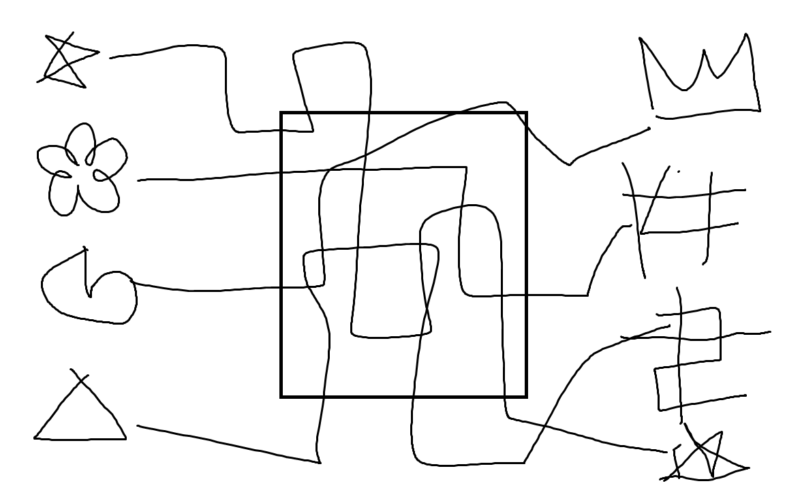

# Leila's line puzzle

Locked Item: Leila's locked box (Leila's%20locked%20box%201dd2f33d583f80928d16f1e42b4fc75b.md)
Puzzle Elements: Leila's fabric (Leila's%20fabric%201dd2f33d583f80dfa17ac7acab111ccf.md)
Owner: https://www.notion.so/1b62f33d583f8032ba00f0bd0c6e5905
Description/Solution: painting on wall with lines that intersect but there's holes in the lines and Leila has a piece of fabric with the continuation of the lines as well as three starting symbols and the ending symbols are translated to numbers using the back of her fabric

